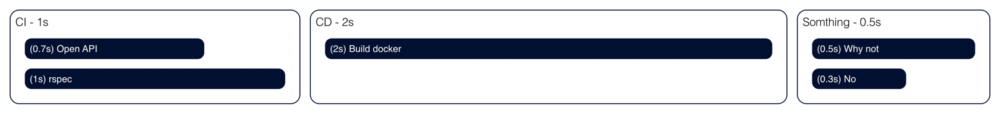

# Lead Time Analysis Viz (POC)

## Getting Started

1. Clone this repo ``
2. Install dependencies `npm install`
3. Run npm start command `npm run start`
4. Edit `src/data.ts`
5. Open your web browser at http://localhost:3000

## Data Type

```typescript
type Job = {
	duration: number,
	name: string,
};

type Stage = {
	duration: number,
	jobs: Job[],
	name: string,
};

type Data = {
	stages: Stage[],
	unit: string,
};
```

## Example


